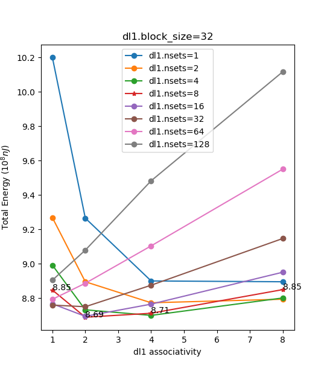

## Equations

`total_power_cycle_cc1` = `avg_total_power_cycle_cc1` $\times$ `sim_cycle`

`avg_total_power_cycle_cc1` = `rename` + `bpred` + `window` + `lsq` + `regfile` + `icache` + `dcache` + `dcache2` + `alu` + `resultbus` + `avg_clock_power_cc1`

default cache configuration: level-1 d-cache 4 way set-associative, 128 sets, 32 bytes cache line; level-1 direct-mapped, 512 sets, 32 bytes cache line; shared level-2 4 way set-associative, 1024 sets, 64 bytes cache line; replacement policy: all LRU; 

## RUU and LSQ only

if LSQ size is fixed, IPC peak when RUU size is twice as large as LSQ size. But if we want to minimize the total power consumption, then RUU size should be set to 16.

Bottleneck question: when RUU size < 2 X LSQ size, then the bottleneck is the RUU since RUU full rate > LSQ full rate. when RUU size >= 2 X LSQ size, then the bottleneck is the LSQ since LSQ full rate > RUU full rate.

However, it's difficult to explain this phenomenon. access pattern of *this* application or some unique feature of this microarchitecture?

If we only consider RUU and LSQ, in order to minimize the total power consumption, we should set their size to 16 at the same time.

> But it still need more explanations....
>
> When LSQ size is fixed and we increase the RUU size gradually, at the beginning RUU size is the bottleneck, so total cycle can be reduced as RUU size increase. We should also mention that RUU starts to consume more energy, but total energy consumption still decreases. However, when RUU size > 2 * LSQ size, the bottleneck becomes LSQ size. Therefore, even if we continue increasing RUU size, total cycle cannot be reduced but RUU consumes more energy per cycle.
>
> If we fix RUU size and vary LSQ size, we can still see the same thing. So we know that the optimal configuration in terms of LSQ and RUU must satisfy that RUU size = 2 * LSQ size.

LSQ=RUU=16, total_rename: 48935993, total_lsq: 30734753, but they do change!

## Continue tuning

### step1

LSQ size = RUU size = 16, total cycle = 41698375, total power = 948387852.0096, LSQ per cycle=0.3606, RUU per cycle=0.1823, il1.miss_rate = 0.0001, dl1.miss_rate = 0.0013, ul2.miss_rate = 0.0419, il1 per cycle=1.3003(5.71%), dl1 per cycle=2.1371(9.39%), ul2 per cycle=0.0026(<<il1/dl1)

first we can try to adjust dl1, its default configuration is `128:32:4:l`. We know that 3Cs of miss rate are compulsory(cannot improve)/capacity/conflict, first we try to adjust set number and associativity individually and keep another argument unchanged(actually we adjust both of them):

and the result is that `dl1.nsets=8` and `dl1.asso=2` is the best(given that `dl1.bsize` is fixed at 32), in this case total energy is $8.69\times10^8\text{nJ}$. In addition, average energy of `dl1` decreases to 0.5021 and the percentage drops to 2.43%. `dl1.miss_rate` is 0.0153 now, which is more balanced.

Question: Do we need to adjust `bsize`? I think we need not. This is because in this simulator the hit time/penalty is fixed(maybe) at 6 cycles? But associavitiy and nsets do affect the miss rate.

Have a look at il1, it percentage is 6.28% now, which is a new bottleneck. The miss rate is 0.0001, which is unnecessarily small. So now we can start to adjust the il1.

### step2

default configuration of il1 is `512:32:1:l`. Total size is 16KiB. total code size of the program is 78KiB, but it doesn't matter. 

We found that if il1 is set to `32:32:4:l` is the best. Figure below:

All data: `il1.miss_rate` = 0.0001, `il1.avg_power`=0.5365(2.73%, while dl1 2.56%, btw ul2 0.13%), total power=$8.2637\times{10^8}\text{nJ}$

we guess that il1 can use FIFO replacement policy since the task is simple and miss_rate is still very low when using LRU, have a try: this does not work very well...

let us check avg lsq&ruu in this case: avg ruu power=0.1818(0.95%), avg lsq power=.3580(1.8737%)btw IPC=1.1137

### step3

maybe we can have a look at the branch prediction?

default `bpred=bimod` with 2048 entries together with a BTB whose nsets and associativity are 512 and 4 respectively, avg bpred power=0.4466(2.27%)

btb->2048 4, clock power decreases???

### step4

ALU

avg fpalu: 0.65

avg ialu: 0.375

see results/step4, ialu=2, fpalu=1, total power=6.0628

motivation: alu access time is small

