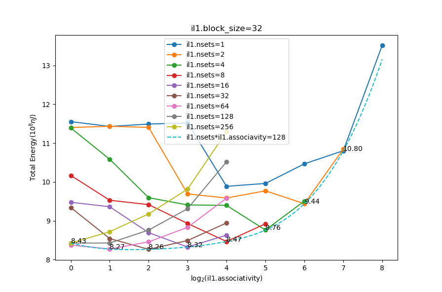

# Coursework1: ILP in the FFT

Yifan Wu

## RUU and LSQ size

LSQ size is $8$ by default, in this case we try to vary RUU size from $2$ to $256$ to see what will happen:

We can see that IPC increases as RUU size increases until IPC peaks at $1.11$ when RUU size is $16$. It can be easily explained by looking at the full rate of RUU and LSQ. When RUU size $\leq$ LSQ size, RUU full rate is about 100% while LSQ full rate is almost 0. Since LSQ and RUU are connected with each other, RUU is the bottleneck which limits IPC. What shows an opposite situation is that LSQ full rate $>$ RUU full rate when RUU size $>$ LSQ size. In this case LSQ is the bottleneck which limits IPC. Therefore, even if we increase RUU size continuously, IPC will not increase.

If we fix RUU size and vary LSQ size, it is not diffcult to imagine that we will see the same phenomenon. According to other statistics provided by the simulator, we can make a more precise conclusion. To be specific, `total_rename_access` and `total_lsq_access` records how many times RUU and LSQ are accessed respectively. We can find that the ratio of `total_rename_access` to `total_lsq_access` is approximately $1.6$. Although this ratio fluctuates under different configurations, it does not fluctuate considerably, which mean that we can use $1.6$ as a reasonable approximation. Given that the throughput of LSQ and RUU are the same under default configuration, the conclusion is that RUU will become bottleneck if $\frac{\text{RUU}\ \text{size}}{\text{LSQ size}}<1.6$, otherwise LSQ will become bottleneck in terms of IPC. 

When it turns to total energy consumption, we can see that it keep decreasing before it hits a bottom at $9.89\times10^{8}\text{nJ}$. After that, it starts increasing. Here we try to give a brief explaination. At the beginning, we know that RUU is the bottleneck which limits IPC. In this case, IPC increases as RUU size rises. However, the energy consumption per cycle also increases since RUU contains more transistors. We know that total energy consumption $\sim\frac{\text{energy per cycle}}{\text{IPC}}$, now IPC increases at a higher speed than energy consumption per cycle, so total energy consumption decreases as RUU size increases. When $\frac{\text{RUU size}}{\text{LSQ size}}>1.6$, we can see that total energy consumption starts increasing. This is because LSQ becomes the bottleneck, so IPC stays the same but energy consumption per cycle still increases as RUU size increases, leading to the increase of total energy consumption.

In order to find a combination of RUU and LSQ size which minimize the total energy consumption, we have to try many possible combinations(LSQ size ranging from 8 to 128, RUU size ranging from 2 to 256)except for these whose $\frac{\text{RUU size}}{\text{LSQ size}}>2$ since they cannot be optimal according to previous analysis. Due to the page limit, we will not list all results here. The best combination is that RUU size and LSQ size are both $16$. In this case, total energy consumption is $9.48\times{10^8}\text{nJ}$.

## Cache

Now let us have a look at the cache. Currently there are 3 caches: a level 1 d-cache(128:32:4:l), a level 1 i-cache(512:32:1:l) and a level 2 cache(1024:64:4:1) used for both caching data and instructions. The energy consumption per cycle of level 1 d-cache, level 1 i-cache, and level 2 cache are 2.1371, 1.3003 and 0.0026nJ respectively. Total energy consumption per cycle is 22.7438nJ, so they constitute 9.39%, 5.71% and 0.01% of total energy consumption respectively. Since the percentage of level 2 cache is extremely small, we can ignore it in this coursework. Given that the miss rate of level 1 i-cache and level 1 d-cache is unnecessarily small, it is a natural idea to reduce their size to decrease total energy consumption. This is because even if we reduce the size of these caches, IPC will not drop significantly since the miss rate of these caches are very small, however the energy consumption per cycle can descend apparently. As a result, total energy consumption can possibly drop.

Firstly we focus on the level 1 d-cache. Its miss rate is 0.0013, which is an apparently unbalanced value. Therefore, we can adjust its number of sets and associavity to reduce its size and see what will happen to the total energy consumption:

The figure show that the total energy consumption is minimal at $8.69\times10^8\text{nJ}$ when the number of set and associavity of level 1 d-cache are 8 and 2 respectively. We reduce the size of level 1 d-cache to $\frac{1}{32}$ of its original value, and now its miss rate is 0.0153, which is 10.76 times larger than the previous data. It can be seen that this is a more balanced configuration.

What should be explained is that why I did not try to vary the block size. This is because doing this mainly have an influence on the hit time of the cache. But in this simulator, these latency is fixed(1 cycle for level 1 cache and 6 cycles for level 2 cache) and I think that they should not be modified. Consequently, I think adjusting the block size will not be very effective.

On top of that, we can reduce the size of level 1 i-cache since its miss rate is very small as well, which is only 0.0001. Just like level 1 d-cache, we can vary its number of sets and associavity ranging from 1 to 256 and 1 to 256 respectively:

In this diagram, the bottom boundary(the blue dashed curve) is made up of the points which satisfys that the production of number of sets and associavity is 128, which means that the size of level 1 i-cache is 4KB. This size is the most appropriate for FFT program, but we still need to determine its number of sets and associavity. The diagram shows that when the number of sets and associavity of level 1 i-cache are 32 and 4 respectively, total energy consumption is the minimum($8.26\times{10^8}$nJ). In this case, the miss rate of level 1 i-cache is still 0.0001 but its size has been reduced to a quarter of its original size. This can also indicate that the miss rate of level 1 i-cache is more sensitive than level 1 d-cache. I guess this is because of the big penalty of branch misprediction.

Let us check the energy consumption of these caches again. Currently, the percentage of the energy consumption of level 1 d-cache, level 1 i-cache and level 2 cache are 2.56%, 2.73% and 0.13% respectively, which are more balanced than those under default configuration.

## Branch Predictor

When it comes to branch predictor, I mentioned that the its accuracy is very good(about 82% for both direction and target prediction). I thought that maybe I could reduce the size of the branch prediction to decrease the energy consumption per cycle without sacrificing the prediction accuracy. However, what was very weird was that after I reduced the size of the bimod and BTB the energy consumption per cycle increased, leading to the result that total energy consumption also rose given that the prediction accuracy almost stayed the same. After I checked the statistics, I found out that the main reason was that the clock's energy consumption per cycle increased significantly. Since clock is not covered in our class, I cannot understand the connection between it and the branch predictior. I tried to increase BTB's  number of sets from 512 to 2048. Counter-intuitively, it led to a smalled total energy consumption even if I cannot explain it.

## ALU

By default, there are 4 integer ALUs and 4 floating point ALUs. However, the whole ALU is only accessed $1.0946$ times per cycle according to `avg_alu_access`, so here is a huge waste. At the same time, these ALUs do consume a lot of energy. To be specific, every integer ALU and floating point ALU consume 0.375 and 0.65nJ respectively per cycle. Under default configuration, the whole ALU consumes 25.02% of total energy. Therefore, it is necessary to reduce the number of these ALUs. After enumerating, it is optimal to keep 2 integer ALUs and a single floating point ALU. I do not want to go deeper to analyze why it is optimal, because I think it is related to the FFT program. In this case, the total energy consumption decreases to $6.0268\times{10^8}$nJ, and the percentage of ALU's energy consumption drops to only 13.35%.

## Conclusion

Final configuration:

* -ruu: size 16
* -lsq:size 16
* -cache:dl1 dl1:8:32:2:l
* -cache:il1 il1:32:32:4:l
* -bpred:btb 2048 4
* -res:ialu 2
* -res:fpalu 1

Final total energy consumption: $6.0268\times{10^8}$nJ.

