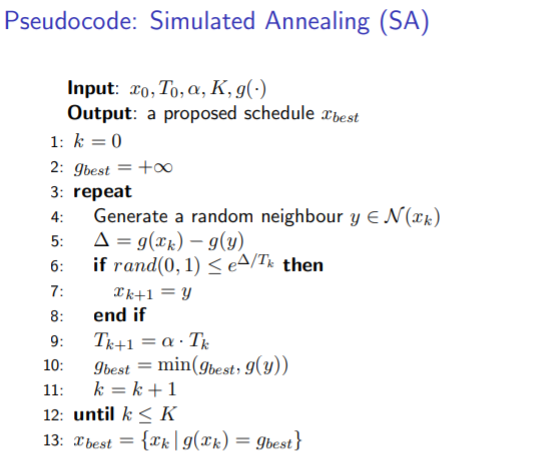

## $1||\max C_j$

Trivial, $\max C_j=\sum p_j$.

## total completion time $1||\sum C_j$

solution: shortest processing time(SPT)

In the order that $p_i\leq p_{i+1}$. Easy to prove.

## $1||\sum w_jC_j$

solution: weighted shortest processing time(WSPT)

Assume that we swap 2 adjacent jobs $J_i,J_j$ in a schedule:

before swap: $w_ip_i+w_j(p_i+p_j)$

after swap: $w_jp_j+w_i(p_j+p_i)$

If better after swap: $w_ip_j<w_jp_i$, which means that $\frac{p_j}{w_j}<\frac{p_i}{w_i}$

so, in the order that $\frac{p_i}{w_i}\leq\frac{p_{i+1}}{w_{i+1}}$.

## Extension of WSPT: job chains

### case 1: non-interruptible

Sort the chains so that $\frac{\sum p}{\sum w}_i\leq\frac{\sum p}{\sum w}_{i+1}$

### case 2: interruptible

Find a suffix so that its $\frac{\sum p}{\sum w}$ is minimal, and then delete this suffix. Do this until all the chains are deleted.

## $1|r_j|\max C_j$

Still trivial. Just keep the machine busy, if no jobs are available, just wait for a job to release.

## $1|r_j,pmtn|\sum C_j$

solution: Shortest remaining process time(SRPT), which means that we schedule a job whose remaining time is minimal at time $t$.

When to schedule a new job: a job just releases, or current job completes.

## $1|r_j|\sum C_j$

NP-hard.

But: approximation using Shortest Remaining Processing Time(SRPT): first run SRPT, then schedule job for $1|r_j|\sum C_j$ in the order that $C_j$ non-decreases in the SRPT result, it is a 2-approximation, which means that $\frac{f(S_A)}{f(S_{OPT})}\leq 2$

proof: in converted-preemptive schedule $S_c$, for job $j$, job $u$ is the nearest job which is earlier than $j$ and it starts at its release time $r_u$, then $C_j(S_c)=r_u+\sum_{i=u}^{j}p_i$. Easy to see that $r_u<C_j(S_{SRPT})$ and $\sum_{i=u}^{j}p_i\leq C_j(S_{SRPT})$, then we have $C_j(S_c)<2C_j(S_{SRPT})$. We also have $\sum C_j(S_{OPT})\geq \sum C_j(S_{SRPT})$ since $S_{OPT}$ is non-preemptive. Finally we have $C_j(S_c)\leq 2C_j(S_{OPT})$, thus $S_c$ is a 2-approximation.

## $1|d_j|\sum L_j$

$d_j$ is the due date of job $j$, $L_j$ is the lateness of job $j$, which means that $L_j=C_j-d_j$

$T_j$ is the tardiness of job $j$, which means that $T_j=\max\{0,C_j-d_j\}$

Since $d_j$ are constant, it is equivalent to $1||\sum C_j$(solution: SPT).

## $1||\max L_j, 1||\max T_j$

Since $T_j=\max\{0,L_j\}$, it is easy to show that they are equivalent.

Solution: earliest due date(EDD), which means that scheduling jobs in non-decreasing $d_j$ order.

Proof: it we switch two adjacent jobs $i,j$ satisfying $d_i<d_j$, then:

job $i$, previously: $L_i=C_{Prev}+p_i-d_i$, now: $L_i=C_{Prev}+p_j+p_i-d_i$

job $j$, previously: $L_j=C_{Prev}+p_i+p_j-d_j$, now: $L_j=C_{Prev}+p_j-d_j$

previously: $\max\{L_i,L_j\}=C_{Prev}+p_i+\max\{-d_i,p_j-d_j\}$

now: $\max\{L_i,L_j\}=C_{Prev}+p_j+\max\{-d_j,p_i-d_i\}$

we know that $d_i<d_j$, then $-d_i>-d_j$, then $p_i-d_i>-d_j$, therefore now $\max\{L_i,L_j\}=C_{Prev}+p_j+p_i-d_i$, it is easy to show that it is larger than previous $\max\{L_i,L_j\}$.

## $1||\sum T_j$

It is NP-hard.

However, if $p_i\geq p_j\rightarrow d_i\geq d_j$, then EDD+SPT(when $d_j$ are the same) is optimal.

Proof: something like EDD's proof.

## $1||\sum U_j$

Here $U_j=1$ if job $j$ is late otherwise $U_j=0$.

Solution: Moore-Hodgson's algorithm, add jobs in non-decreasing $d_j$ order like EDD, if it is still late, remove the job whose $p_j$ is the largest from $S_O$ to $S_L$. $S_O$ on-time, in-order. $S_L$ late, in any arbitrary order.

$1||\sum w_jU_j$ is NP-hard.

## Dynamic Programming

$G(J)=\min_{j\in J}\{G(J-j)+g_j(J)\}$

When listing: stages(size of $J$), each $J$, each $j,g_j(J),...$ for each $J$

## Search Tree

Something like a search based on priority queue, not a classical DFS.

## Simulated Annealing

## Tabu Search

Mention that if $g(y)<g_{best}$, even if $(i,j)\in\mathcal{T}$ we must accept it

## $P||\sum C_j$

non-decreasing $p_j$ order, put jobs into 1, 2, ..., m, 1, 2, ...

WSPT(non-decreasing $\frac{p_j}{w_j}$ order) is sub-optimal with the worst ratio $\frac{1+\sqrt{2}}{2}=1.21$

## $P|pmtn|C_{\max}$

$M^*=\max\{\max p_j,\sum p_j/m\}$

Construction: firstly fill machine 1 to $M^*$, then machine 2, ..., finally machine $m$.

## $P||C_{\max}$

NP-hard.

List scheduling, given a priority list of the jobs, send the first job in the list if a machine is available, worst-case ratio $R=2-\frac{1}{m}$

proof: last completed job $k$ starts at time $t_k=C_{\max}^{LS}-p_k$, $mt_k\leq \sum p_j-p_k$, then we have:

$mC_{\max}^{LS}\leq \sum p_j+(m-1)p_k$, $\sum p_j\leq mC_{\max}^{OPT},(m-1)p_k\leq (m-1)C_{\max}^{OPT}$,

thus $C_{\max}^{LS}\leq (2-\frac{1}{m})C_{\max}^{OPT}$

Longest processing time(LPT), List scheduling with nonincreasing $p_j$ order, better worst-case ratio $R=\frac{4}{3}-\frac{1}{3m}$

## $P|in-tree,p_j=1|C_{\max}$

Hu's algorithm, $\alpha_j$ equals to length of the longest path from this job to the root plus 1, every time:

fill ready jobs in non-increasing $\alpha_j$ order into as much machines as possible, then eliminate these jobs in the workflow

ideal $m$ value in order to achieve $C_{\max}=L$: if we want to complete in time $t=L+\Delta$, then:

$m-1<\max_{q\in[1,L]}\{\frac{1}{q+\Delta}\sum_{j=1}^{q}l(L+1-j)\}\leq m$

Hu's algorithm is also optimal for $P|out-tree,p_j=1|C_{\max}$(change all directions to get an in-tree, run Hu's algorithm, then reverse the schedule), $P|in-trees,p_j=1|C_{\max}$(add a dummy root job)

## $2|prec,pmtn,p_j=1|C_{\max}$

Muntz-Coffman algorithm, job partitions $S_1,...,S_k$ so that if $a\in S_j$ is a successor of $b\in S_i$ then $i<j$, for each partition wrap around on all machines

also optimal for $P|pmtn,in/out-tree,p_j=1|C_{\max}$

worst-case ratio of $P|pmtn,prec|C_{max}$ is $R=2-\frac{2}{m}$

 ## Nash Equilibrium

player $1\sim N$, set of actions $x_i\in\mathcal{X}_i$, cost for player $i: J_i(x_1,...,x_N)$

Pure Nash Equilibrium(PNE): no player can decrease his cost only by changing his own action, $(x_1^*,...,x_N^*)$ so that $\forall i,\forall x_i\in\mathcal{X}_i$, $J_i(x_i^*,x_{-i}^*)\leq J_i(x_i,x_{-i}^*)$

find PNE: best-response algorithm: initial strategy, work $i=1$: $x_i\leftarrow \arg\min_{x_i\in \mathcal{X}_i}J_i(x_i,x_{-i})$, work $i=2$, ..., work $i=N$, work $i=1$, ... until $x$ is a PNE

Mixed Nash Equilibrium(MNE): $\sigma_i$ is a vector of probabilities of player $i$, $C_i(\sigma_1,...,\sigma_N)=\mathbb{E}_{x\sim\sigma}[J_i(x)]=\sum_{x\in\mathcal{X}}p(x)J_i(x)$, we say that $(\sigma_1^*,...,\sigma_N^*)$ is a MNE if $\forall i,\forall x_i'\in\mathcal{X}_i$, $C_i(\sigma_i^*,\sigma_{-i}^*)\leq C_i(x_i',\sigma_{-i}^*)$, which means that no player can decrease the exception of his cost by only changing his action distribution to an arbitrary action

## Potential Game

Game that we can construct a function $\Phi:\mathcal{X}_1\times...\times\mathcal{X}_N\rightarrow\mathbb{R}$ so that $\forall i,x_i,y_i\in\mathcal{X}_i$, $J_i(x_i,x_{-i})-J_i(y_i,x_{-i})=\Phi(x_i,x_{-i})-\Phi(y_i,x_{-i})$

Theorem: Potential game has PNE(minimum of $\Phi$ must be a PNE), best-response algorithm converges in a finite number of steps

## Congestion Game

Every player can choose from several subsets of the whole resource set

$J_i(x)=\sum_{r\in x_i}l_r(|x|_r)$

Congestion game is a potential game. $\Phi(x)=\sum_r\sum_{j=1}^{|x|_r}l_r(j)$

Proof: two different strategy of player $i:x_i,y_i$, 3 types of resources: $x_i\cap y_i,x_i\backslash y_i,y_i\backslash x_i$

$J_i(x_i,x_{-i})-J_i(y_i,x_{-i})=\sum_{r\in x_i\backslash y_i}l_r(|x_i,x_{-i}|_r)-\sum_{r\in y_i\backslash x_i}l_r(|y_i,x_{-i}|_r)=\Phi(x_i,x_{-i})-\Phi(y_i,x_{-i})$

singleton CG, which means that $\forall i,\forall x_i,|x_i|=1$, best response algorithm converges in $\mathcal{O}(n^2m)$ if there are $n$ players and $m$ resources.

## Price of Anarchy

Social cost: $SC:\mathcal{X}\rightarrow\mathbb{R}$ evaluate the efficiency of an equilibrium for all the players

most of the time $SC(x)=\sum_i J_i(x)$

Price of Anarchy: $\text{PoA}=\frac{\max_{x\in\text{PNE}}SC(x)}{\min_{x\in\mathcal{X}}SC(x)}$

## Smooth Game

a game is called a $(\lambda,\mu)$-smooth game where $\lambda>0,\mu<1$ if $\forall x,x'\in\mathcal{X},\sum_{i}J_i(x_i',x_{-i})\leq \lambda SC(x')+\mu SC(x)$ where $x'=(x_1',...,x_N')$

the price of anarchy of a $(\lambda,\mu)$-smooth game $\leq\frac{\lambda}{1-\mu}$

Proof: $x\in\text{PNE},\forall x'\in\mathcal{X},SC(x)=\sum_i J_i(x)\leq \sum_i J_i(x_i',x_{-i})\leq \lambda SC(x')+\mu SC(x)$

therefore, $\lambda SC(x')\geq (1-\mu)SC(x),\frac{SC(x)}{SC(x')}\leq\frac{\lambda}{1-\mu}(\forall x\in\text{PNE},\forall x'\in\mathcal{X})$

affine congestion game is a $(\frac{5}{3},\frac{1}{3})$-smooth game, thus its price of anarchy $\leq2.5$

Proof: we need to prove that $\sum_i J_i(x_i',x_{-i})\leq \frac{5}{3}SC(x')+\frac{1}{3}SC(x)$

Observation1: $SC(x)=\sum_r|x|_rl_r(|x|_r)$

Observation2: $\sum_i J_i(x_i',x_{-i})=\sum_i\sum_{r\in x_i'}l_r(|x_i',x_{-i}|_r)\leq\sum_i\sum_{r\in x_i'}l_r(|x|_r+1)=\sum_r|x'|_rl_r(|x_r|+1)$

Now only need to prove that $|x'|_rl_r(|x_r|+1)\leq\frac{5}{3}|x'|_rl_r(|x'|_r)+\frac{1}{3}|x|_rl_r(|x|_r)$

affine: $l_r(t)=\alpha t$, now prove $b\alpha(a+1)\leq\frac{5}{3}\alpha b^2+\frac{1}{3}\alpha a^2$

prove $\forall a,b\in\mathbb{Z}_{\geq 0},b(a+1)\leq\frac{5}{3}b^2+\frac{1}{3}a^2$(easy)

## second-price auctions

private valuation $v_i$, bid $b_i$, price $p$, $U_i=0$ if lose $v_i-p$ otherwise

second-price auction: if all players tell the truth, all players can achieve a non-negative utility 

## single parameter setting

allocation space: $\mathcal{X}\in \mathbb{R}^n$, result of the auction

allocation rule: $x(b):\mathbb{R}^{n}_{\geq 0}\rightarrow\mathcal{X}$, bids to allocation

payment rule: $p(b):\mathbb{R}^n_{\geq 0}\rightarrow\mathbb{R}^n_{\geq 0}$, how much every player should pay for

let utility $U_i(b)=v_ix_i(b)-p_i(b)$

Dominant(truth-telling) strategy(DS): $U_i(v_i,b_{-i})\geq U_i(b_i,b_{-i})$

Incentive Compatible(IC): $U_i(v_i,b_{-i})\geq 0$

Surplus maximizing: $\max_{x\in\mathcal{X}}\sum_i v_ix_i$

Implementable allocation rule: allocation rule $x(b)$ is implementable if there exists a payment rule $p(b)$ so that $(x,p)$ is DSIC

Monotone allocation rule: $x(b)$ is monotone if $b_i'\geq b_i\Rightarrow x_i(b_i',b_{-i})\geq x_i(b_i,b_{-i})$

Myerson's Lemma:

I. allocation rule $x(b)$ is implementable $\Leftrightarrow$ $x(b)$ is monotone

II. if $x(b)$ is monotone, there exists an unique analytic payment rule $p(b)$ so that $(x,p)$ is DSIC

Proof P1: $(x,p)$ DSIC $\Rightarrow$ $x$ monotone

let $0\leq y<z$, fix $i,b_{-i}$, $x(z)=x_i(z,b_{-i}),p(z)=p_i(z,b_{-i})$

($U_i(b)=v_ix_i(b)-p_i(b)$, Recall DS: $U_i(v_i,b_{-i})\geq U_i(b_i,b_{-i})$)

when $z=v_i$, we have $zx(z)-p(z)\geq zx(y)-p(y)$

when $y=v_i$, we have $yx(y)-p(y)\geq yx(z)-p(z)$

therefore $z(x(y)-x(z))\leq p(y)-p(z)\leq y(x(y)-x(z))\Rightarrow(y-z)(x(y)-x(z))\geq 0$

Proof P2: $x$ monotone $\Rightarrow$ construct $p$ s.t. $(x,p)$ DSIC and $p$ unique

if we want $(x,p)$ to be DSIC, then we must guarantee that $z(x(y)-x(z))\leq p(y)-p(z)\leq y(x(y)-x(z))$

Observing $x(\cdot,b_{-i})$, $x(y)=x(z)\Rightarrow p(y)=p(z)$

discontinuity: assume that $x(z)>x(y)$, $\lim_{y\rightarrow z^-}$, $p(y)-p(z)=z(x(y)-x(z))$

construction: when met a new discontinuity point $z$ of function $x$, $p(z)=p(z^-)+z(x(z)-x(z^-))$

if we fix $p(0)=0$, then $p_i(b_i,b_{-i})=\sum_{z\in\text{Disc}(x_i(\cdot,b_{-i})),z\leq b_i}z(x(z)-x(z^-))$

In practice:

