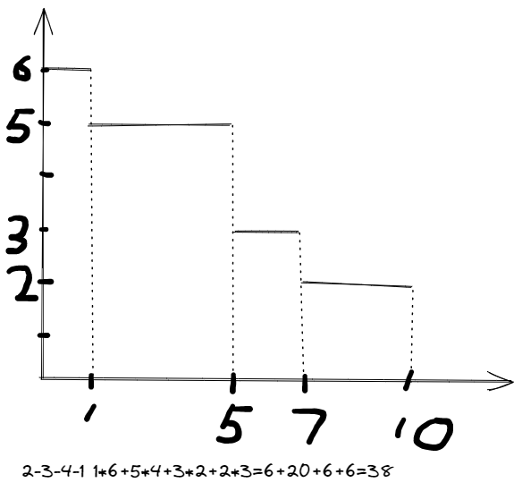

## 1

* a: $C=\{11,19,8,18,13\}$, $w=\{1,2,3,4,5\}$, $r=\frac{1}{2}$

  $f=\sum w_j(1-e^{-rC_j})=1-e^{-5.5}+2-2e^{-9.5}+3-3e^{-4}+4-4e^{-9}+5-5e^{-6.5}=15-e^{-5.5}-2e^{-9.5}-3e^{-4}-4e^{-9}-5e^{-6.5}$

  $f=14.933$

* b

  $p=\{3,5,4,2,5\}$, $C=\{7,19,4,14,12\}$, $w=\{1,2,3,4,5\}$

  $f=14.548$
  
* c

  $W_j=C_j-p_j$
  
  pre-emptive: $W=\{8,14,4,16,8\}$, $g=10$
  
  non pre-emptive: $W=\{4,14,0,12,7\}$, $g=7.4$
  
* since $W_j=C_j-p_j$, apparently $g$ is a regular measure.

## 2

* 1,2,3 -> C={7,9,14}

  1,3,2 -> C={7,12,14}

  2,1,3 -> C={2,9,14}

  2,3,1 -> C={2,7,14}

  3,1,2 -> C={5,12,14}

  3,2,1 -> C={5,7,14}

* SPT, since p2<p3<p1, the optimal order is 2->3->1, $\sum C_j=2+7+14=23$, which is the smallest

* $f=1 \times 2 + 8\times7+3\times14=2+56+42=100$

  $f=\max\{2-10,7-3,14-7\}=7$

  $f=0+4+7=11$

## 3

For iteration $i(0\leq i < k)$, we have $\frac{n}{2^{i}}$ sorted lists each of which contains $2^{i}$ elements. What we need to do in this operation is that dividing the lists into $\frac{n}{2^{i+1}}$ pairs and merging every pair of small sorted list into a large sorted list. Now let us think about how to merge efficiently. The problem is that now we are given two sorted lists which have $2^{i}$ elements and we are asked to merge them into a new sorted list with $2^{i+1}$ elements. We can easily do this by pointer scanning. This is, we maintain two pointers pointing to the smallest element of both lists. To begin with, apparently they are at the beginning of the lists since they are sorted. And everytime we choose a smaller element from the two elements that the two pointers point to, append this element to the result list and update the pointer of the list where this element comes from. Therefore, we can complete this task by comparing $2^{i+1}$ times since every element appended to the result list needs a comparison. In this iteration we should do this merge task for $\frac{n}{2^{i+1}}$ times, so the overall time complexity of a iteration if exactly $\mathcal{O}(2^{i+1}\times\frac{n}{2^{i+1}})=\mathcal{O}(n)$. There are $k$ iterations where $n=2^{k}$ or $k=\log_{2}^{n}$. So the time complexity of the whole $k$ iterations is $\mathcal{O}(n\log n)$.

## 4

> if $i$ then $j$, measure is $w_ip_i+w_j(p_i+p_j)$
>
> if $j$ then $i$, measure is $w_jp_j+w_i(p_i+p_j)$
>
> $i$ then $j$ is better if and only if $w_jp_i<w_ip_j$ which is equivelant to $\frac{w_i}{p_i}>\frac{w_j}{p_j}$ or $\frac{p_i}{w_i}<\frac{p_j}{w_j}$

* $p=\{3,1,4,2\}, w=\{2,1,2,1\}$, $\frac{p_j}{w_j}=\{1.5,1,2,2\}$

  2,3,4,1 $C=\{10,1,5,7\}$, $f=20+1+10+7=38$

  2,4,3,1 $C=\{10,1,7,3\}, f=20+1+14+3=38$

* 

* consider every rect divided by horizontal lines, its height is $w_j$ and its width is $C_j$

## 5

**wrong answer!! 18 not 8! But I don't want to calc again.**

* $\frac{p_A}{w_A}=\frac{3+6+6+5}{6+18+12+8}=\frac{20}{44}=\frac{5}{11},\frac{p_B}{w_B}=\frac{4+8+10}{8+17+18}=\frac{22}{43},\frac{p_B}{w_B}<\frac{p_A}{w_A}$

  so 5,6,7->1,2,3,4

  $C=\{25,31,37,42,4,12,22\},w=\{6,18,12,8,8,17,18\}$

  $f=2120$

* iteration1: for A $\frac{3}{6}=0.5,\frac{9}{14}=0.643,\frac{15}{26}=0.577,\frac{20}{34}=0.588$, for B $\frac{4}{8}=0.5,\frac{12}{25}=0.48,\frac{22}{43}=0.512$, so 5->6

  iteration2: for B $\frac{10}{18}=0.556$, so 1

  iteration3: for A $\frac{6}{8}=0.75,\frac{12}{20}=0.6,\frac{17}{28}=0.607$, so 7->2->3->4

  so 5->6->1->7->2->3->4

  $C=\{15,31,37,42,4,12,25\},w=\{6,8,12,8,8,17,18\}$

  $f=1804$

* $\frac{p_j}{w_j}=\{0.5,\frac{1}{3},0.5,0.625,0.5,0.471,0.556\}$

  order: 2,6,1,3,5,7,4

  $C=\{17,6,23,42,27,14,37\},w=\{6,8,12,8,8,17,18\}$

  $f=1882$

  