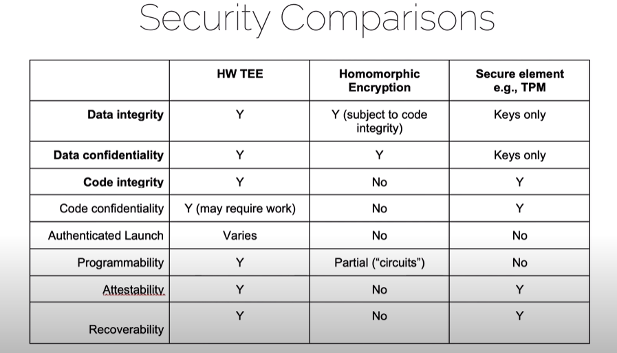
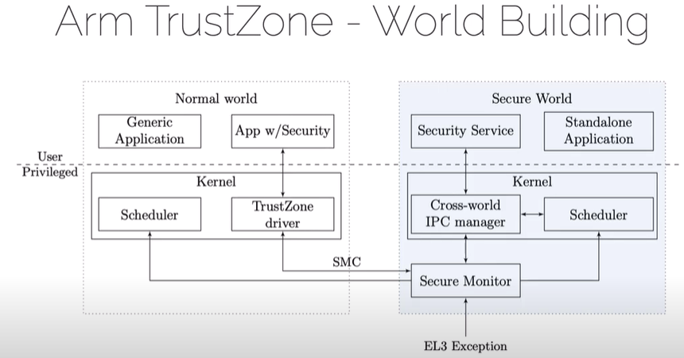
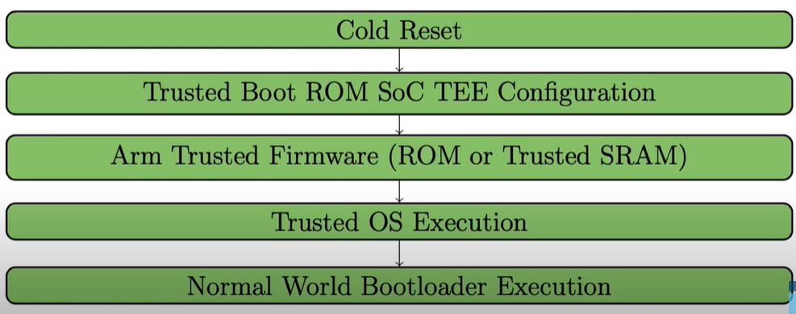

## Materials

[Technical Overview of TEE, including SGX/TrustZone/RV PMP(Video)](https://www.youtube.com/watch?v=MREwcSo0uz4)

> Defined by CCC, 3 core properties: data confidentiality(cannot be viewed)/integrity(cannot by changed) & code integrity within TEE
>
> Here are some important aspects of TEE, but this presentation only talks about some of them
>
> 
>
> other aspects: code confidentiality(maybe for intellectual property), authenticates launch(only run applications when are proved to be secure), programmability, attestability(measure the origin and current state of TEE, similar to **static/dynamic trust**?), recoverability
>
> attestation: ensure the integrity of TEE itself, usually rely on the root of trust(RoT), and it can be checked locally or remotely
>
> **Arm TrustZone**
>
> * OpenTEE
>
> * separation of normal/secure world
>
>   
>
>   
>
> **Intel SGX**, too complicated...
>
> **RISC-V PMP**, can be used to create enclaves in x86, [keystone-enclave.org](https://keystone-enclave.org/), an ecosystem like OP-TEE but base on RV

[Trusted RV(Video)](https://www.youtube.com/watch?v=BuHbgefCxvM)

> Currently RV does not have a TEE specification, instead all the TEE frameworks(I guess, but at least one) that can be found are based on RV PMP, so it has not been mature yet?

[TEE Wikipedia](https://en.wikipedia.org/wiki/Trusted_execution_environment)

[A great survey about TEE](https://people.apache.org/~xli/presentations/tee.pdf)

