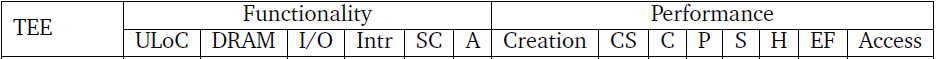
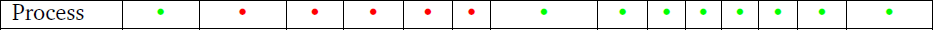
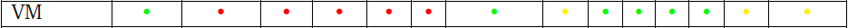
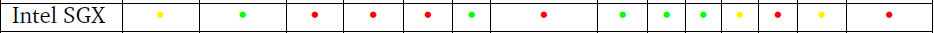
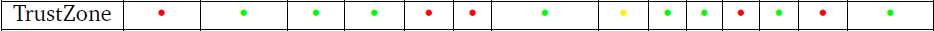
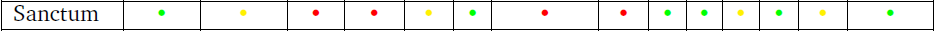
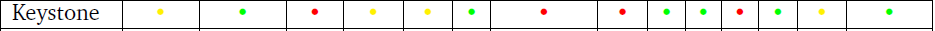
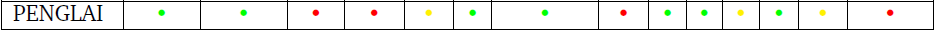
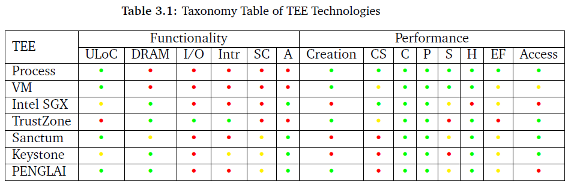

# Taxonomy of Trusted Execution Environment Technologies

**Yifan Wu**
Department of Computing
Imperial College London
10/05/2022

---

## **Introduction**
## Background Information
## Metrics
## Evaluation 
## Conclusion

---

## Introduction
## **Background Information**
## Metrics
## Evaluation 
## Conclusion

---

## Definitions

* **Trusted**: cannot be compromised in any way
* **Trusted Execution Environment (TEE)**
  confidentiality and integrity of the execution are guaranteed
* **Trusted Computing Base (TCB)**
  TEE is based on TCB
* **Enclave**
  TEE implementation
* **Trusted World/Normal World**
  consists of only trusted/untrusted HW/SW components

---

## Security Requirements
* **Confidentiality(aka Secrecy/Privacy)**: no secrets can be revealed
* **Integrity**: cannot be modified without detection
* **Authenticity**: check TEE's "identity" before transferring data
* **Availability(Optional)**: e.g, Denial of Service attacks

---

## Core Mechanisms
### Hardware-based Isolation
* hardware-based access control
  e.g. invalid instruction exception on RISC-V
* physical resource partition
  e.g. cache partitioning for side-channel attacks
* secure resource sharing
  i.e. clear data on a context switch, HW and SW co-design

---

### Problems of Hardware-based isolation
* assuming that privileged SW (OS, hypervisor) is trusted
* not true; can be compromised by exploiting vulnerabilities in these SW

### Cryptography
* complement of hardware-based isolation
* create a trusted channel (C&I) from an untrusted medium
* requirements: secret keys/source of randomness
* applications: encryption/digital signature/authorized certificate/key exchange algorithm

---

### Cryptography applications in TEE
* Secure Boot: from an on-chip secret to TCB
* Data Encryption: data flows from Trusted World to Normal World
* Integrity Check: data flows back from Normal World to Trusted World
* Attestation: for TEE's authenticity

---

## Introduction
## Background Information
## **Metrics**
## Evaluation 
## Conclusion

---

# Metrics
## Functionality(Security) Metrics
## Performance Metrics

---

## Functionality Metrics
The first classification:
* bottom layer: TCB
  * Unverified Lines of Code in the TCB (ULoC): possible vulnerabilities
* medium layer: *internal states* of TEE
  * C&I of data on DRAM
  * C&I of data related to I/O
  * Secure interrupts
  * Resistance of side-channel attacks
* top layer: TEE as a service provider
  * Attestation support

---

## Functionality Metrics
The second classification:
Resistance of direct/indirect attacks
* direct attacks: physical attacks on DRAM/bus
* indirect attacks: side-channel attacks

---

## Performance Metrics
* Management Overhead
  * container creation latency
  * context switch overhead
* Scalability Limitations
  * concurrency
  * parallelism
  * storage overhead: metadata
  * performance degradation on huge workloads
* External Access Overhead
  * calling external functions
  * accessing DRAM or peripherals

---

## Introduction
## Background Information
## Metrics
## **Evaluation**
## Conclusion

---

## Evaulation
* Classical Models
  * Process
  * Virtual Machine
* Intel SGX
* ARM TrustZone
* RISC-V
  * Sanctum
  * Keystone
  * PENGLAI Enclave

---

### Process

#### Functionality
* if the OS is trusted, C&I of DRAM/peripherals can be guaranteed
* otherwise, OS can directly access DRAM and I/O
* do not support secure intr/side-channel attacks due to lack of HW support
* ULoC: no TCB

---

### Process

#### Performance
* creation: loading ELF to memory
* context switch: changing the privilege level, processor state pollution
* scalability: only limited by available resources
* external function calls: system calls
* accessing DRAM/peripherals: MMU&TLB/system calls

---

### Virtual Machine

#### Functionality
* need to trust the hypervisor
#### Performance
* context switch & external function calls: another level of abstraction
* accessing DRAM: 2-stage address translation

---

### Intel SGX

#### Functionality
* ULoC: SGX SDK by Intel
* C&I of data on DRAM: Memory Encryption Engine (MEE)
  * between Last-Level Cache (LLC) and DRAM
  * encrypting data before writing to DRAM
  * integrity check: record hash value of each memory block's content, check when loading to LLC
  replay attacks: counter-based Merkle Tree design
* attestation support

---

### Intel SGX

#### Performance
* creation: calculating the enclave's hash value when creating it
* huge workload: total size of active enclaves (with metadata) is only 128MiB, frequent switch in/out
* access DRAM: encryption/decryption per interaction with DRAM
* storage: 25% on DRAM and $\frac{1}{2^{15}}$ on-chip of protected region
* external function call: dedicated instruction; proxy functions from SGX SDK

---

### ARM TrustZone

#### Functionality
* ULoC: complexity of SW stack
* C&I of DRAM: on-chip trusted storage
* secure interrupt & I/O: hardware-based access control (General Interrupt Controller and AXI)
* do not support attestation by default

---

### ARM TrustZone

#### Performance
* storage overhead: on-chip trusted SRAM of several hundred bytes
* external function calls: 7 processor states, many processor state changes
* context switch: should bypass the secure monitor
* access DRAM: do not need to encrypt/decrypt based on on-chip storage

---

### RISC-V
* open-source Instruction Architecture Set with Extensions
* open-source CPU implementations 
* more flexible than SGX/TrustZone, involves HW modifications

---

#### Sanctum

Simulating SGX Enclaves on RISC-V
#### Functionality
* ULoC: a lightweight and unverified secure monitor
* C&I of DRAM: trusted off-chip HW thus suffers from physical attacks
* cache timing side-channel attacks: flushing per-core cache on a context switch (secure resource sharing)

#### Performance
* context switch: flushing per-core cache on a context switch
* not sensitive to huge workloads

---

#### Keystone

#### Functionality
* ULoC: a huge TCB including the secure monitor, the runtime per enclave and the enclave app
* C&I of DRAM: a huge on-chip storage of 2MiB used exclusively by an enclave
* partial support for secure interrupts
* cache side-channel attacks: cache partitioning (physical resource partitioning)

---

#### PENGLAI Enclave

* Host Page Table: reduce memory access checks
* Mountable Merkle Tree: support workloads up to 512GiB with minimal storage overheads
* fork-style fast enclave creation while supports attestation
* cache side-channel attacks: cache line locking, special-purpose instructions, increases the overhead of context switches

---

## Introduction
## Background Information
## Metrics
## Evaluation 
## **Conclusion**

---

* DRAM
  * on-chip RAM (cost: on-chip storage)
  * data encryption & integrity check (cost: access latency)
* secure I/O or interrupts: requires special hardware architecture
* side-channel attacks: physical resource partitioning or secure resource sharing (cost: context switch latency)
* Attestation (cost: creation latency)
* ULoC&context switch&external function calls: complexity of the SW stacks

---

# Q & A

Thank you for listening!

